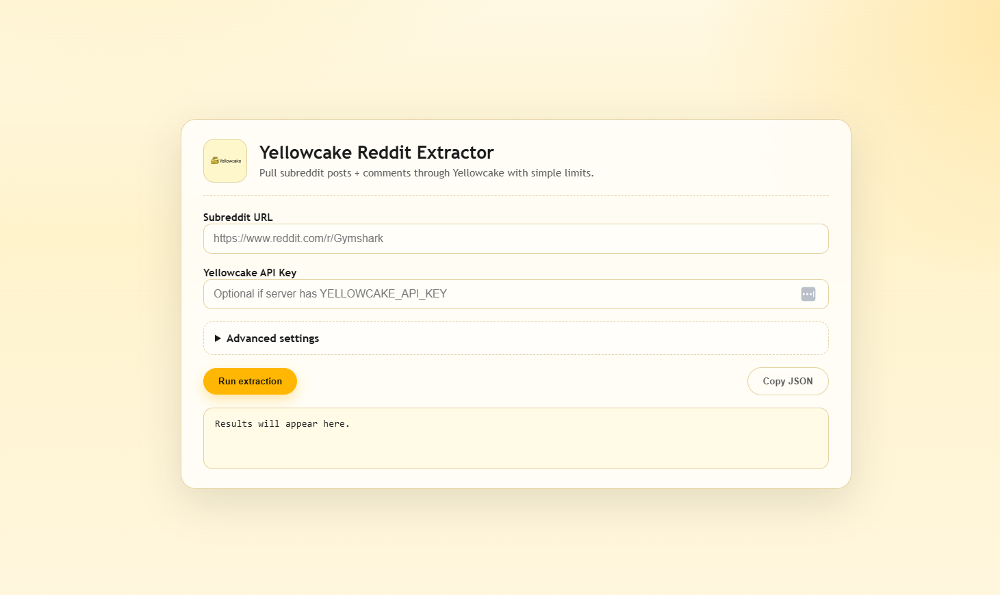

# Yellowcake Reddit Extractor



**Yellowcake-first demo** that extracts subreddit posts + comments using the Yellowcake API, then shows the structured JSON in a simple web UI.

## What it does
- Uses Yellowcake to extract subreddit posts and comment threads.
- Lets users control max posts, comments per post, and sort.
- Optionally saves JSON output to a file.
- Shows results immediately in the browser (with copy-to-clipboard).

## Why Yellowcake
This demo is built around Yellowcake as the core extraction engine. The site calls the backend, which runs the Yellowcake extractor and returns clean JSON ready for analysis or downstream processing.

## Project structure
- `index.html` - Frontend UI and client-side request logic.
- `app.py` - Flask backend that runs the Yellowcake extraction CLI and returns JSON.
- `yellowcake_api.py` - Yellowcake API client + Reddit extraction helpers.
- `yellowcake.png` - Logo asset.

## Run locally
1) Install dependencies:
```bash
pip install -r requierment.txt
```

2) Create a Yellowcake API key (see docs: https://yellowcake.dev/docs), then set it locally:
```bash
set YELLOWCAKE_API_KEY=YOUR_KEY
```

3) Start the server:
```bash
python app.py
```

4) Open:
`http://127.0.0.1:5000`

## CLI usage (direct)
```bash
python yellowcake_api.py --subreddit-url "SUB_REDDIT_LINK" --max-posts 5 --comments-per-post 2 --use-yellowcake --api-key YOUR_KEY
```

## Notes
- Yellowcake docs: https://yellowcake.dev/docs
- Generate an API key in the Yellowcake dashboard before running the extractor.
- The backend writes a raw Yellowcake payload to `yellowcake_raw.json` for debugging.
- The UI can save JSON to a local path if provided.

## Screenshot
The README expects a screenshot at `docs/yellowcake-ui.png` (replace it with the UI image you shared).
